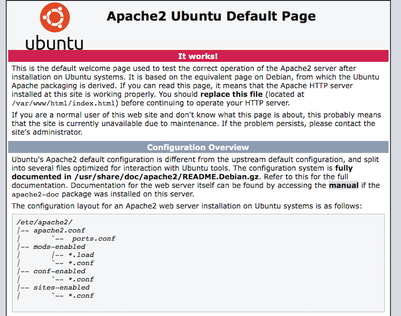

Title: Set Up VPS on Linode - Part 2
Date: 2017-04-08 08:00
Tags: devops
Category: Tech
Slug: set-up-VPS-on-Linode-part-2
Summary: Continuing from [Set Up VPS on Linode - Part 1](https://guizishanren.com/set-up-VPS-on-Linode-part-1), here's Part 2 on DNS (nameserver and IP address), Apache (folder structure, virtual hosts), and enabling HTTPS with SSL certificate from Let's Encrypt.

Continuing from [Set Up VPS on Linode - Part 1](https://guizishanren.com/set-up-VPS-on-Linode-part-1), here's Part 2 on DNS (nameserver and IP address), Apache (folder structure, virtual hosts), and enabling HTTPS with SSL certificate from Let's Encrypt.

## Configure DNS Record

### Change NameServer

If the hosting instance is changed from one company (say, Digital Ocean) to another (say, Linode), first we need to change the nameserver of `mydomain.com`. This info shall be provided by the VPS service provider's [FAQ/Help/Doc section](https://www.linode.com/docs/networking/dns/dns-manager-overview). 

Nameserver record is maintained by the domain registrar. Make the change at the dashboard of the domain registrar for `mydomain.com`.

```
ns1.linode.com
ns2.linode.com
ns3.linode.com
ns4.linode.com
ns5.linode.com
```

Check if the nameserver has taken effect:

	dig +short NS linkqlo.com

If the instance still resides on the same VPS server, then this step can be skipped (because the nameserver remains the same) and proceed to the next.

### Change IP Address

DNS record could be maintained by various parties. It could be the original domain registrar like Godaddy, or could be the web hosting company like Linode itself. Different companies have different names for the DNS dashboard, but the underlying process and format is largely similar. [Linode's DNS Manager Guide](https://www.linode.com/docs/networking/dns/dns-manager-overview) provides a primer on this topic.

Open up the DNS record file, in the section for **A/AAAA records**, change the **IP Address** all the relevant **Hostname** to the new IP `12.34.56.78`. If the domain name for this DNS file is `mydomain.com`, The list of such Hostnames usually include:

- `(blank)` (blank so that `http://mydomain.com` will be directed to `12.34.56.78`)
- `www` (`http://www.mydomain.com` will be directed to `12.34.56.78`)
- `apollo` (`http://apollo.mydomain.com` will be directed to `12.34.56.78`)
- `subdomain1` (`http://subdomain1.mydomain.com` will be directed to `12.34.56.78`
- `subdomain2` (`http://subdomain2.mydomain.com` will be directed to `12.34.56.78`
- etc

TTL (Time-To-Live) determines how long a change in DNS record will take effect/propagate. Every VPS provider has different default TTL from 24 to 48 hours. I usually set that to be `300` (5 minutes) so that the DNS propagation can complete sooner.

Check if the IP address has been propagated:

	dig +short server mydomain.com
	dig +short server subdomain1.mydomain.com
	
Note: if the previous DNS record has been set up with **Reverse DNS**, this needs to be reset first, before the **A** record change for `mydomain.com` can take effect. If it's not reset, `mydomain.com` will keep reverting back to the old IP immediately when the new IP `12.34.56.78` becomes effective. 

For Linode, go to Dashboard/Remote Access/Network Access/Public Network/Reverse DNS to reset and set up a new target/hostname. 
	
### Update /etc/hosts

SSH back to `apollo` as `userjoe`,

	sudo vim /etc/hosts
	
Add one more with the new public IP address:

	12.34.56.78 apollo.mydomain.com apollo
	
This will prevent apollo from spitting out `sudo: unable to resolve host` warning message.

Note: keep the line for `127.0.1.1 ` the way it is in the hosts file. Attempt to change that to something more meaningful like `127.0.1.1 apollo` would actually lead to unwanted warnings elsewhere. 
	
## Install Apache Web Server

A decade-long debate is [Apache-vs-Nginx](https://www.digitalocean.com/community/tutorials/apache-vs-nginx-practical-considerations). Apache is older and available everywhere. Nginx is newer and its popularity is quickly rising. I still go with Apache, just to make sure things don't break - as they already work well.

Apache-httpd-2.4.25 can be downloaded and installed in Nix, but it seems to take a few extra steps to complete the installation. To avoid potential issues, I resort to the good old `apt-get`:

	sudo apt-get update
	sudo apt-get install apache2

Check to see if apache has been installed properly:

	which apache2

It should display:

	/usr/sbin/apache2

Run this to verify syntax:

	sudo apache2ctl configtest

It should display:

	Syntax OK

Now, go to the below URL to verify Apache2 has been installed properly:

	http://12.34.56.78

The browser should display:



## Subdomain or Folder

When hosting multiple projects/sites on a single VPS instance, we can go with either a subdomain like `projectabc.mydomain.com` or just a folder like `mydomain.com/projectabc. 

From brand-awareness standpoint, the folder approach is slightly easier for general audience to understand that this **projectabc** is under the umbrella of **mydomain.com**. It's certainly easier to remember. Subdomain style is less intuitive for general viewers at large.

From technical standpoint, it requires less hassle to set up folders as no separate Virtual Host File is needed. Every new subdomain needs to have a separate **Virtual Host File** (an Apache configuration file for each site) in `/etc/apache2/sites-available`, then it needs to be enabled in `/etc/apache2/sites-enabled`. Subdomain also needs to have its own **A** record defined in the DNS zone file, similar to `www.mydomain.com`. 

In terms of file location, in both approaches, files for `projectabc` can be stored at the same location in `/var/www/mydomain.com/public_html/projectabc`. For the folder approach, no extra work is needed and the URL will just load up this folder. For the subdomain approach, this path needs to be defined in the Virtual Host File. 

All in all, I still go with folder style. It's much easier.

## Configure Named-Based Virtual Hosts

Disable the default Apache virtual host:

	sudo a2dissite *default

Reload Apache server:

	sudo service apache2 reload
	
Navigate to `/var/www directory:

	cd /var/www

Create a folder to hold the website:

	sudo mkdir mydomain.com
	
Create a set of folders to store files, logs and backups:

	sudo mkdir -p mydomain.com/public_html
	sudo mkdir -p mydomain.com/log
	sudo mkdir -p mydomain.com/backups

Create the virtual host file for the website by copying the existing default example one:

	sudo cp /etc/apache2/sites-available/000-default.conf /etc/apache2/sites-available/mydomain.com.conf

In editing `mydomain.com.conf` file, copy the below section:

```
# Domain: mydomain.com
# Public: /var/www/mydomain.com/public_html/

<VirtualHost *:80>
	ServerAdmin webmaster@mydomain.com
	ServerName mydomain.com
	ServerAlias www.mydomain.com

	DirectoryIndex index.html index.php
	DocumentRoot /var/www/mydomain.com/public_html
	
	LogLevel  warn
	ErrorLog  /var/www/mydomain.com/log/error.log
	CustomLog /var/www/mydomain.com/log/access.log combined
 </VirtualHost>
```

Enable this virtual host configuration:

	sudo a2ensite mydomain.com.conf
	sudo service apache2 restart
	
[Digital Ocean provides very clear instructions how to do this](https://www.digitalocean.com/community/tutorials/how-to-set-up-apache-virtual-hosts-on-ubuntu-14-04-lts).
	
## Enable HTTPS

A certificate from a Certificate Authority (CA) is needed to enable HTTPS. [Let's Encrypt](https://letsencrypt.org/getting-started/) provides an easy-to-use service for free. The only caveat is that it needs to be renewed every 3 months manually.

Let's Encrypt recommends using a [Certbot](https://certbot.eff.org/) to automate the process. At the Certbot landing page, choose the **Software** and the **System** as `Apache` and `Ubuntu 16.04 (xenial)`

Login as `root`, install the dependencies and certbot:

	apt install software-properties-common
	add-apt-repository ppa:certbot/certbot
	apt-get update
	apt-get install python-certbot-apache
	
Run certbot:

	certbot --apache
	
The on-screen process is fairly straightforward. Just need to provide an email address, choose both `mydomain.com` and `www.mydomain.com`, and `2: Secure - Make all requests redirect to secure HTTPS access`.

With root access, certbot will add a new virtual host `/etc/apache2/sites-available/mydomain.com-le-ssl.conf` and enable that for apache2 server. 

Test if the SSL has been installed successfully:

	https://www.ssllabs.com/ssltest/analyze.html?d=mydomain.com
	https://www.ssllabs.com/ssltest/analyze.html?d=www.mydomain.com

This website will test the result for both IPv4 and IPv6. Both should have **A** grade when the test is complete.

A sour point for many users of Let's Encrypt is that [it requires **root** access to make certain changes](https://certbot.eff.org/faq/#does-certbot-require-root-administrator-privileges), which makes many uncomfortable. There are many ways to get around this issue. You can either create a specific group as the owner of the Let's Encrypt related folders and execute certbot command from users in that group; or just write your own shell script to define path in your `userjoe` home folder.

Another hassle is that the SSL certificate has to be renewed every 3 months. There are various technical ways to automate that, but I would just create a Google Calendar event with an email notification to myself 3-5 days before the expiration date.