Title: Favorite Podcasts of 2017
Date: 2017-05-19 08:00
Tags:
Category: Amusement 
Slug: favorite-podcasts-of-2017
Summary: Back in 2008~2009 when I was soaked in the underground music scene in Beijing, I thought about creating an English podcast to introduce indie rock music from China to the western audience. The inspiration came from a four-hour mp3 file of [Anthony Wong](https://en.wikipedia.org/wiki/Anthony_Wong_(singer)) of [Tat Ming Pair of Hong Kong](https://en.wikipedia.org/wiki/Tat_Ming_Pair) in his early radio DJ years. In this audio clip Anthony Wong was commenting in Cantonese on [Depeche Mode](https://en.wikipedia.org/wiki/Depeche_Mode)'s latest album in the background music of [Tour de France](https://en.wikipedia.org/wiki/Tour_de_France_(song)) by [Kraftwerk](https://en.wikipedia.org/wiki/Kraftwerk). It was devilishly cool.

Back in 2008~2009 when I was soaked in the underground music scene in Beijing, I thought about creating an English podcast to introduce indie rock music from China to the western audience. The inspiration came from a four-hour mp3 file of [Anthony Wong](https://en.wikipedia.org/wiki/Anthony_Wong_(singer)) of [Tat Ming Pair of Hong Kong](https://en.wikipedia.org/wiki/Tat_Ming_Pair) in his early radio DJ years. In this audio clip Anthony Wong was commenting in Cantonese on [Depeche Mode](https://en.wikipedia.org/wiki/Depeche_Mode)'s latest album in the background music of [Tour de France](https://en.wikipedia.org/wiki/Tour_de_France_(song)) by [Kraftwerk](https://en.wikipedia.org/wiki/Kraftwerk). It was devilishly cool.

That podcast didn't happen. Chinese accent was not a thing yet then, and it was hard to focus on pursuing something like this in Beijing, or anything in Beijing at all. Also, podcast was still in its early days. There wasn't a huge audience for it. Good programs were limited. I used to tune in for [A Prairie Home Companion](https://en.wikipedia.org/wiki/A_Prairie_Home_Companion) and [NPR's It's Politics!](http://www.npr.org/sections/itsallpolitics/archive) in Boston. Both shows seemed fairly remote to the bustling life in Beijing.

Fast forwarding to 2017 in Palo Alto, CA, I find myself spending 30 ~ 60 minutes a day listening to podcasts. Thanks to a very handy [LG Electronics Tone Pro HBS-750 Bluetooth Wireless Stereo Headset](https://www.amazon.com/LG-Electronics-HBS-750-Bluetooth-Wireless/dp/B00FO0IHMY/ref=sr_1_1?ie=UTF8&qid=1495317855&sr=8-1&keywords=LG+HBS-750&refinements=p_n_condition-type%3A6461716011), I listen to podcasts during running, walking, driving, waiting, and washing dishes. It's become an indispensable daily routine for me. 

The technology hasn't changed all that much, but the amount of high-quality content available nowadays through podcast is astounding. There is not a week that goes by without me hearing about some new podcasts popping up from well established news outlets. Everybody who can book famous guests is doing his/her own podcast show now. 

Here's a list of my favorite 14 podcasts with recommended episodes to get you started:

## The Tim Ferriss Show

<a href="https://overcast.fm/itunes863897795/the-tim-ferriss-show">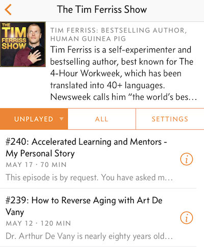</a>

Ferriss deconstructs the success formula for world-class performers of all walks with hard-core long-form content. As a startup founder, I've learned a great deal from his very insightful interviews. He produces the ultimate self-improvement show that rules all other self-improvement shows. He is a [social phenomenon and wonder to behold](http://fourhourworkweek.com) who has an uncanny ability to find common ground with any guest. Sometimes I get turned off with the ads and feel he tries too hard to relate to the guest, but it's hard to look away from his epic interviews of [Kevin Kelly](http://kk.org) and Jamie Foxx. 

Featured episode: [#118: How Philosophy Can Change Your Life, Alain de Botton](https://overcast.fm/+BmGXzAXOE).

## State of the Union with Jake Tapper

<a href="https://overcast.fm/itunes309575412/state-of-the-union-with-jake-tapper">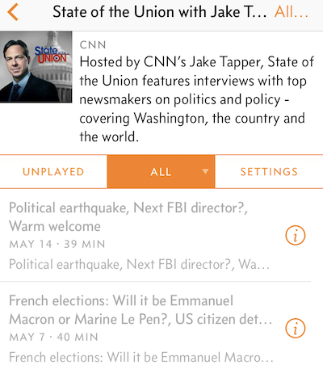</a>

When President Obama jokes about you at White House Correspondents' Dinner, you have arrived (the irony is unintended...SAD). Jake Tapper is one of the best interviewers now on networks. His clout was evident in 2016 election, when he routinely interviewed major candidates every Sunday. It was unreal. He demonstrates first-class journalistic skill in asking the right question and getting meaningful answers from his interviewees (unless your name is Kellyanne Conway, who clearly lives in an alternative universe with alternative facts). 

Featured episode: [Tim Kaine, Rudy Giuliani and our expert panel on Oct 8](https://overcast.fm/+oGqwdI7k). Witness how Tapper destroyed Giuliani two days after the infamous Hollywood Access tape broke out, when Giuliani was the ONLY human being willing to defend Trump (even Chris Christie gave up at that point). 

## NPR: Pop Culture Happy Hour

<a href="https://overcast.fm/itunes278974813/pop-culture-happy-hour">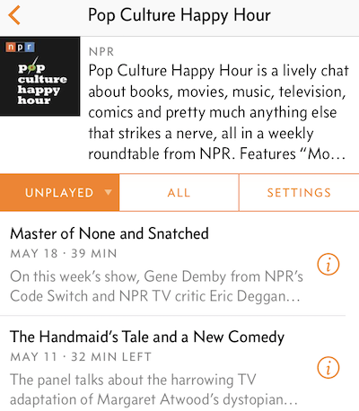</a>

I get my weekly pop culture fix from Linda Holmes, Stephen Thompson and Glen Weldon. Being effortlessly funny with enviable chemistry, they're such a fun trio to listen to. There are many podcast shows on entertainment. This is easily the best. Other shows either try too hard to be funny, or wonder into meaningless rambling about the hosts themselves. Linda's team gets that balance, just right. In general I trust their taste in movies and TV (Glen plays Final Fantasy XV. Checked.) and get off on their jokes a lot. 

Featured episode: [The Fate of the Furious, Plus Clapbacks and Feuds](https://overcast.fm/+Ht-YjTy1k).

## NPR: Politics Podcast

<a href="https://overcast.fm/itunes1057255460/npr-politics-podcast">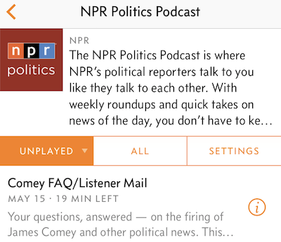</a>

I probably spend the most time with this podcast. The team from NPR does an awesome job covering every major story on capital hill. Most podcasts, in radio station's tradition, have multiple chairs. This is where professional radio hosts outshine amateurs, as it takes a combination of science and art to have multiple voices forming a clear discussion. Nobody does this better than NPR. This show stands out for several things: 1) You can just feel the energy and passion of this team talking about things they love. The spirit is infectious. 2) [Ron Elving](http://www.npr.org/people/1930203/ron-elving) is a national treasure. 3) A nice personal touch from their "can't let this go this week" segment.

Featured episode (every episode with Ron Elving): [Weekly Roundup: Thursday, April 27, A shutdown deadline deferred as the 100th day approaches](https://overcast.fm/+Ht-SCckAg).

## The Daily (The New York Times)

<a href="https://overcast.fm/itunes1200361736/the-daily">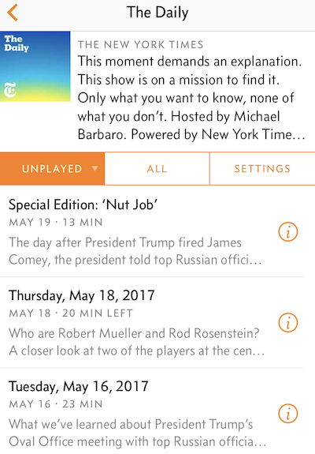</a>

Most episodes from The Daily are around 20 minutes. This is very convenient for me as I often can't commit 40~60 minutes to finish an episode, which is the standard length for most podcasts. Michael Barbaro from The New York Times gets me started everyday on major news with short interviews of journalists from The Times. 

Featured episode: [Friday, May 19, 2017, The latest revelations from the Comey memos and from James Comey’s confidant, who talked on the record — and on tape — to The New York Times. Guest: Michael S. Schmidt](https://overcast.fm/+H9d4QRu2E).

## The New Yorker Radio Hour

<a href="https://overcast.fm/itunes1050430296/the-new-yorker-radio-hour">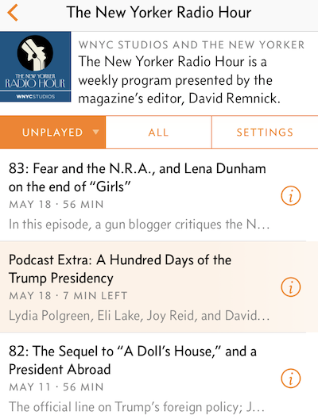</a>

I got to know David Remnick from his [AN AMERICAN TRAGEDY](http://www.newyorker.com/news/news-desk/an-american-tragedy-2) on November 9, 2016, a historical moment for which many years later, many of us will look back and wonder, where I was, and what I was doing then? I became a fan immediately. Remnick is better at writing than talking, as his voice carries a sense of eagerness that his statue in the media doesn't need necessarily. That said, he's David Remnick after all.

Featured episode: [56: Leonard Cohen’s Last Days and Donald Trump’s First Term](https://overcast.fm/+FZssVizjI).

## The Axe Files with David Axelrod

<a href="https://overcast.fm/itunes1043593599/the-axe-files-with-david-axelrod">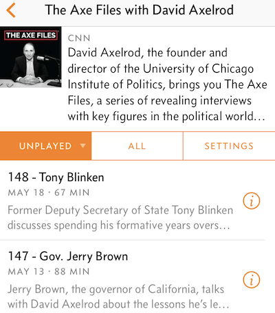</a>

Three years ago when I listened to Axelrod's podcast for the first time, I didn't know who he was and thought he was a bit rude sometimes to his guests, as he had a tendency to cut them off at slightly off timing. I know [who he is now](https://en.wikipedia.org/wiki/David_Axelrod) and understand why he can get away with it. He basically carried Obama and sent him from Chicago to the White House. To be fair, he's no professional radio host. That explains his occasional off-timing in interviews. Axelrod's podcast on CNN has an interesting theme - how they got here? He interviews heavyweights and discusses their transformational journeys to understand how they became who they are today. Those interviews are fascinating.

Featured episodes:

- [114 - Thomas Friedman](https://overcast.fm/+FPeS9R7LU)
- [108 - President Barack Obama](https://overcast.fm/+FPeRiqQCA)
- [99 - Steve Kerr](https://overcast.fm/+FPeSso904)

## a16z

<a href="https://overcast.fm/itunes842818711/a16z">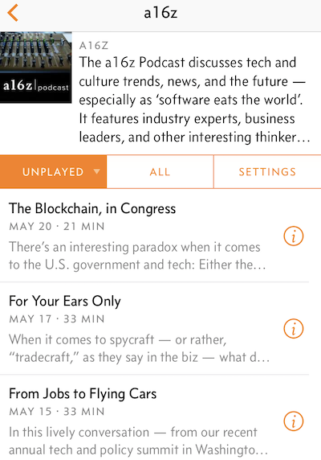</a>

Surprisingly, good podcasts on technology are hard to come by. Some are just too long and taking themselves too seriously with illusional self ego (This Week in Tech), or just doesn't know how to talk. Many are painful to listen to. a16z from Silicon Valley's top VC [Andreessen Horowitz](https://a16z.com) is the best I've tried. Domain experts, from analysts to partners of Andreessen Horowitz, talk about the latest trends in technology, and get to pretty good depth. The host is not a technical person but she does a reasonable hosting job of steering discussions into the right direction.

Featured episode: 

- [When Humanity Meets A.I. with Fei-Fei Li](https://overcast.fm/+BlzGXgYK0)
- [Tech and Entertainment in the ‘Era of Mass Customization’ on Netflix](https://overcast.fm/+BlzGWhkb0).

## Geek's Guide to the Galaxy

<a href="https://overcast.fm/itunes395738416/geeks-guide-to-the-galaxy-science-fiction-interviews-sci-fi-books-and-writing-movie-reviews">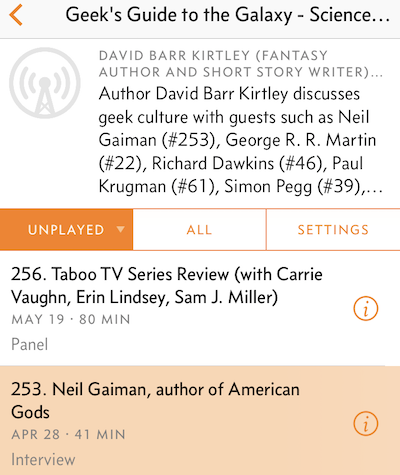</a>

When the host [David Barr Kirtley](http://davidbarrkirtley.com) starts speaking, you can tell instantly he's a geek. He's got that geek's wonky voice. After finishing up voluminous episodes from Tim Ferriss religiously, David Kirtley's voice is a refreshing change, and kinda cute. Kirtley's hosting is not nearly as smooth as those from NPR or Ferriss, but it's a special type of charm to listen to one geek interviewing a few other geeks. 

Featured episodes (does it get any geekier than these two?):

- [253. Neil Gaiman, author of American Gods](https://overcast.fm/+CyUDi14A)
- [183. Star Wars: The Force Awakens (with John Joseph Adams, Matt London, Rajan Khanna, Jordan Hamessley London)](https://overcast.fm/+CyUN4LCc)

## Soundings from the New York Review of Books

<a href="https://overcast.fm/itunes284527588/soundings-from-the-new-york-review">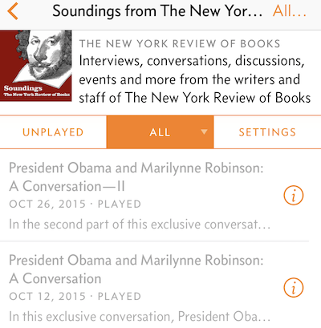</a>

The podcast from the prestigious [New York Review of Books](http://www.nybooks.com), which sits at the peak of Mt. Olympia for American literal intellectuals. Its founder and editor [Robert B. Silvers](https://en.wikipedia.org/wiki/Robert_B._Silvers) just passed away in March 2017. It doesn't seem to have a regular schedule. President Obama was invited to interview Marilynne Robinson last year, a rare honor for an American president.

Featured episode: [President Obama and Marilynne Robinson: A Conversation](https://overcast.fm/+j_sEXTp8)

## The Monocle Arts Review

<a href="https://overcast.fm/itunes972167373/monocle-24-the-monocle-arts-review">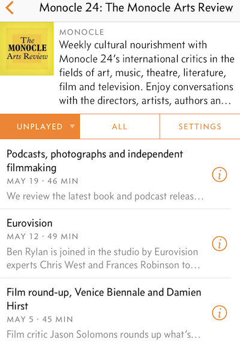</a>

This list would not be meaningful without something from [Monocle](https://monocle.com/radio/shows/). They have a sprawling lineup of podcasts now, from [The Monocle Weekly](https://overcast.fm/itunes300684061/monocle-24-the-monocle-weekly), [Culture with Robert Bound](https://overcast.fm/itunes474762474/monocle-24-culture-with-robert-bound) to [The Monocle Arts Review](https://overcast.fm/itunes972167373/monocle-24-the-monocle-arts-review). Only [Slate](http://www.slate.com/articles/podcasts.html) can rival its comprehensiveness, but Monocle is so much cooler.

Featured episode: [Film round-up, Venice Biennale and Damien Hirst](https://overcast.fm/+ERVTDkkCY)

## The New Yorker: Politics and More

<a href="https://overcast.fm/itunes268213039/the-new-yorker-politics-and-more">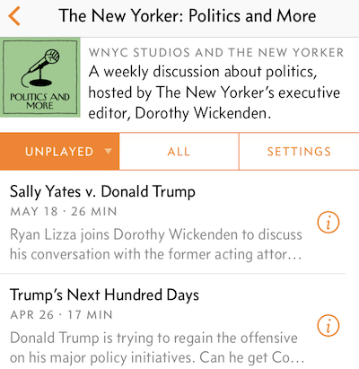</a>

The New Yorker’s executive editor, Dorothy Wickenden, in her cool composure, hosts insightful interviews. She doesn't necessarily chase the story of the day, as it's an obligation for many other around-the-clock podcasts. 

Featured episode: [Michael Anton and Robin Wright Talk to David Remnick about Trump’s First Trip Abroad](https://overcast.fm/+FUWRHIP4k).

## The New York Public Library Podcast

<a href="https://overcast.fm/itunes804982781/the-new-york-public-library-podcast">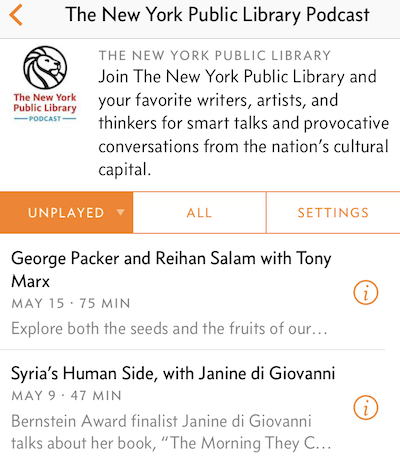</a>

I wish I could spend more time with this show. They have great speakers doing public talks in New York Public Library, with a mature and sophisticated audience asking live questions. 

Featured episode: [Paul Krugman on Fake News, Lying Candidates, and What Public Intellectuals Need to Do](https://overcast.fm/+BfI7DUEM0)

## NPR: Fresh Air

<a href="https://overcast.fm/itunes214089682/fresh-air">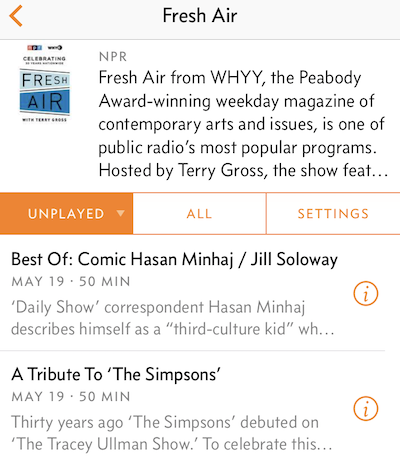</a>

Not every podcast I listen to is about politics or entertainment (yeah...right). Fresh Air is more varied, like its name suggests. 

Featured episode: [Best of: Alec Baldwin on SNL / Trans Punk Rocker Laura Jane Grace](https://overcast.fm/+Ht0yjnVHM)

Apple's native podcast app is fairly bad. I use [overcast app](https://itunes.apple.com/us/app/overcast-podcast-player/id888422857?mt=8) for podcasts. 
