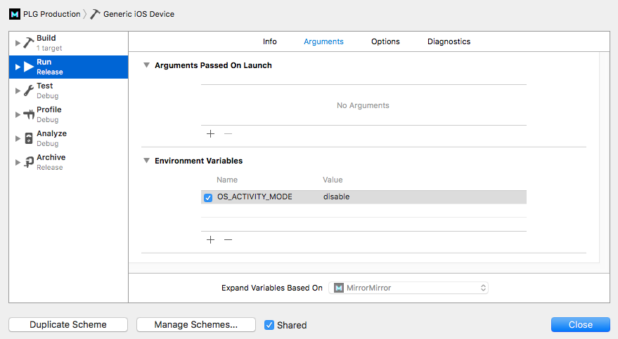
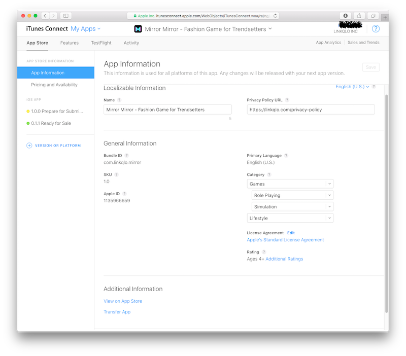
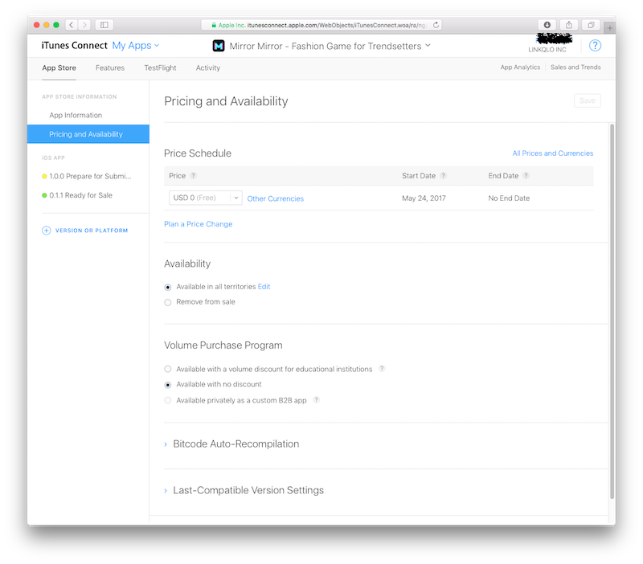
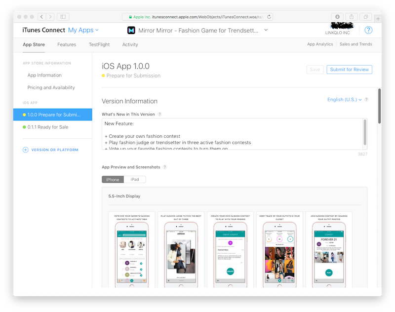
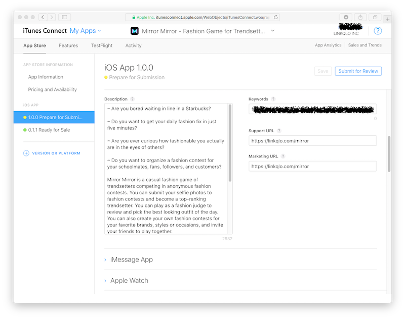
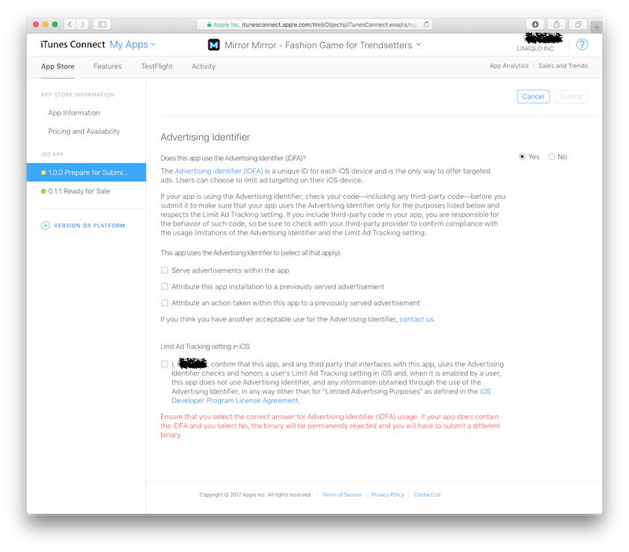
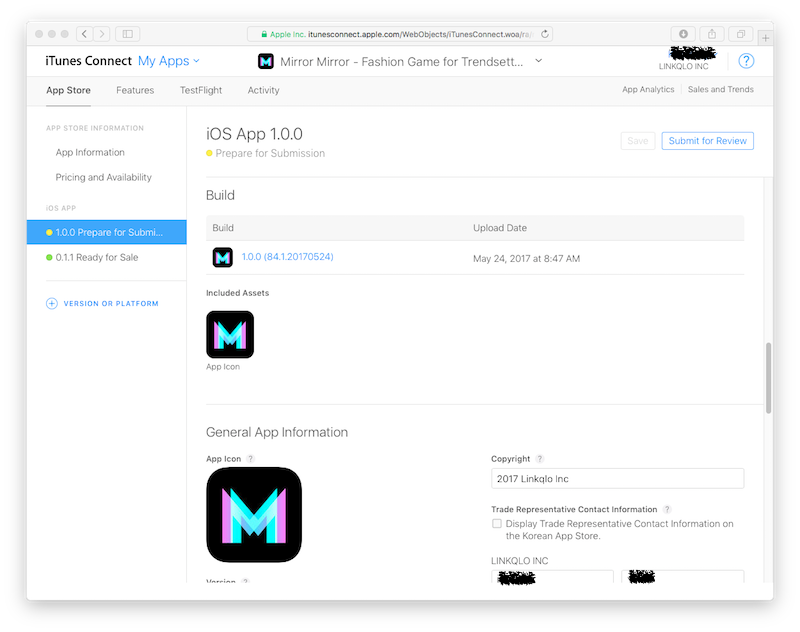
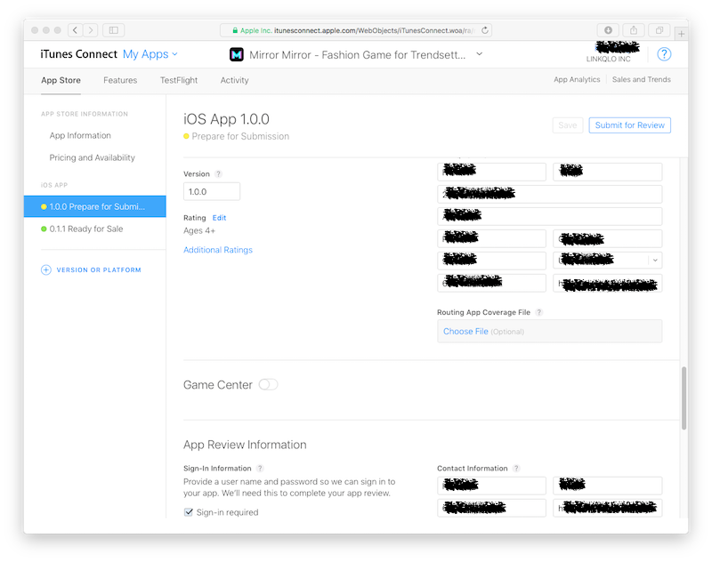
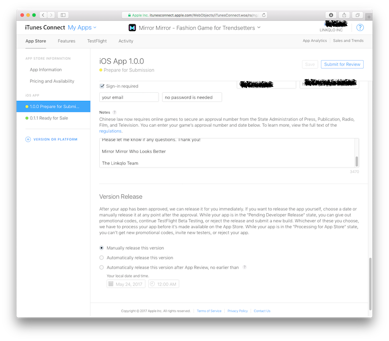

Title: How To Make App Store Submission
Date: 2017-05-25 08:00
Tags: 
Category: Tech 
Slug: how-to-make-app-store-submission
Summary: Making an app submission to Apple's App Store is like configuring Amazon's AWS service. From a technical standpoint it's not scientifically difficult, nor an engineering feat worth bragging about, but it's complicated and often confusing because we have to play by the rules set by Apple and Amazon and that introduce a whole world of pains on its own. It's a muddy water where if you have been there, done that, you know what to do, sort of, through a series of trials and errors. If you are new to this process or haven't done this in a few months, you just have to man up and read through some notes from the past in order to stay on the right path. 

Making an app submission to Apple's App Store is like configuring Amazon's AWS service. From a technical standpoint it's not scientifically difficult, nor an engineering feat worth bragging about, but it's complicated and often confusing because we have to play by the rules set by Apple and Amazon and that introduce a whole world of pains on its own. It's a muddy water where if you have been there, done that, you know what to do, sort of, through a series of trials and errors. If you are new to this process or haven't done this in a few months, you just have to man up and read through some notes from the past in order to stay on the right path. 

I started making regular App Store submissions since early 2015. Apple changes the process frequently, often making its own documentation outdated. Useful guides are hard to find even on Stack Overflow, because it's difficult to ask the right question. The below flow works as of May 2017.

## Phase I: Xcode

For the first build ever to be submitted to iTunes Connect on a new app, there are a lot more settings to configure. This workflow assumes a straightforward normal update. 

Update the **Version number**. [Semantic Versioning 2.0.0](http://semver.org) provides some guiding principles on how to have a good version serial number. 

Update the **Build number**. It has to be continuously incremental as [Apple requires in this technical note](https://developer.apple.com/library/content/technotes/tn2420/_index.html). I use a naming convention of `xxx.z.yyyymmdd`. xxx is a 3-digit serial number. z has two possible values, 1 for **Production** and 0 for **Staging**. For every submission, I increments xxx by 1, pick the right z, and use the current date for the last 8 digits.

Since these two values have changed, Xcode's `info.plist` file is modified. Git add/commit/push, then [git tag this commit](https://guizishanren.com/how-to-git-tag). 

Pick the right **Scheme** for archiving the binary. Scheme in iOS is a complicated topic and can easily mess up the deployment. iTunes Connect submission requires phase **Archive**. Make sure it's set to `Release`, not Debug.

Detach any iOS device from the mac. Pick `Generic iOS Device` right next to the scheme on the menu bar. This submission binary cannot be built on a connected iOS device.

**Menu=>Product=>Clean** to clean up Xcode's cache to make sure the submission build has a clean slate to start.

**Menu=>Product=>Archive** to start building the archive of the binary. Hopefully there will be no red warnings on the left panel, which will lead to build failure. Yellow warnings are fine but should be resolved if possible. 

When build succeeds, a separate **Organizer** window from Xcode will open up. Press the button on the right that says **Upload to App Store** to start the submission to iTunes Connect. 

This is also the place where the **dSYM** file can be downloaded for any previous build for diagnostic purpose. Crashlytics would need this file.

When the upload is successful, close out Xcode and go to [iTunes Connect](https://itunesconnect.apple.com/login).

Uploading to iTunes Connect requires a stable Internet connection. While this is a given in US, it could be a major challenge from within China. At one time my team and I spent eight hours making numerous futile submissions to iTunes Connect when I happened to be in China then. It was no fun.

## Phase II: iTunes Connect

### App Information

#### Name

Pick a unique name. Unlike Google's Play Store, App Store requires each app name to be unique, which is becoming quite a difficult task nowadays. 

Use a long name to satisfy the uniqueness requirement. The entire name should include two parts: the first part **A** is your "ideal" name that you hope no one else is using (impossible); the second part **B** is like a tag line. The real one that is dear to your heart, is  **A**. As in many other naming exercises, picking an app name can be an emotional and sentimental process. Based on the way App Store works, it's less critical now to make sure your app is the only one with **A**. When an iOS user searches "A" in App Store, all the **A**s will appear, with different **B**s. Among all these **A**s, which one comes up on top, is a function of how many users have downloaded the app. So just focus on building a great product and marketing it well. Eventually your app name will ascent to the first page, no matter how wacky its **B** reads.

Claim the name by creating a placeholder app with minimum assets like several make-up screenshots. You can hold the spot without submitting a binary for 3 months. It's a bit of squatting but nonetheless permitted by Apple. 

#### Privacy Policy URL

The company's website at the minimum should have two pages: **Privacy Policy**, and **Terms and Conditions**.

#### Category

While there are some small differences among different major categories, as of 2017 all the major app categories are very saturated and competitive. It's not like we can just flip a category and game the system to send the app to the top of the chart. Besides picking `2` **Major Categories** (visible to App Store users), also pick two **Minor Categories** (not visible to App Store users).

#### Rating

Go as low as possible, which is `Ages 4+` for the maximum audience reach. Apple can be hypocritical sometimes. Instagram currently carries *12+* rating, though it should totally be in 17+ bucket, just as Youtube.

#### Other

The rest of the information is filled in from the binary build from Xcode.

### Pricing and Availability

#### Price Schedule

Pick the right price tier. Setting price tier warrants a whole article on its own. Apple provides a rather intuitive way of configuring that. 

#### Availability

Soft-launch vs official-launch is a topic on its own. Pick the relevant countries for this release.

### Prepare for Submission

#### iOS App / Version

Rule No. 1, **SAVE** whenever an edit is made, or whenever this button on top-right is active.

#### Description

Write a few paragraphs of eye-catching executive summary in the vein of an elevator speech that answers the question:

**WHY SHOULD ANYONE CARE TO DOWNLOAD THIS APP**

#### Keywords

This warrants a PhD exercise on its own. Only 100 characters are allowed, or 10-13 words or so. 

#### What's New in This Version

Two main topics: **new features** and **bug fixes**. This section is visible to general audience of App Store, so it's not exactly the internal tech memo that lists out all the changes under the hood from the previous version. You might have fixed a well hidden nasty bug and improved the app's speed by 500%. Whether the general app users need to know that is a different matter.

It's also becoming a thing to write funny notes of insider jokes here, like "Joe got fired because he typed rm -rf * as root". It plays off the irony that nobody really reads this section for any app in App Store.

#### App Preview and Screenshots

**Screenshots** could be a major pain without using the right tool. App Store has extremely strict [specifications about the screen dimensions of the screenshots](https://developer.apple.com/library/content/documentation/LanguagesUtilities/Conceptual/iTunesConnect_Guide/Chapters/Properties.html). Screenshots will not be allowed for addition if they miss by just 1 pixel. 

These days creating sleek app screenshots is becoming a form of design art, much more so than designing a landing page for a website (who reads website now anyway?). Getting screenshots from within the app is easy. Rendering them nicely with an iPhone frame, with inviting annotations on the side, is hard. 

I've been using the wonderful service of [Launchkit.io](https://launchkit.io) for the last two years. It's a very handy tool to add iPhone frame, add annotations, and automatically generate full set of screenshots for all the current prevailing iPhone sizes. I suppose someone with good Photoshop skill can do that in Photoshop as well, but Launchkit makes the whole tedious process so much easier. 

**App Preview** is a 15~30-second video to explain what the app is and does. It's not the same as "app video". App video is an inspiring advertisement video that talks about how great the app is, with a script, beautiful actors and soothing voice, etc. It's usually 1-2 minutes, good for showing off on Vimeo. App Store's app preview video is strictly a tutorial how-to video. It's very procedural and dry. We made a lovely video for Linkqlo app:

<iframe src="https://player.vimeo.com/video/170667109" width="640" height="360" frameborder="0" webkitallowfullscreen mozallowfullscreen allowfullscreen></iframe>

<a href="https://vimeo.com/170667109">Linkqlo Introduction</a> from <a href="https://vimeo.com/linkqlo">linkqlo</a> on <a href="https://vimeo.com">Vimeo</a>.

...but App Store rejected our request to use it as the **Preview** video. So be it.

#### Advertising Identifier

If advertising, like Google's Admob, is used in the app, choose `Yes`. 

It's too laborious to finish writing the rest of the steps, but the screenshots are below. 

