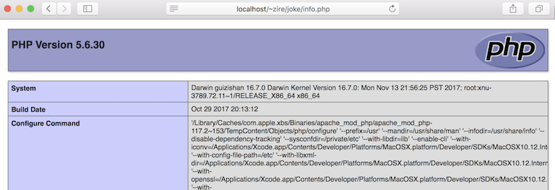
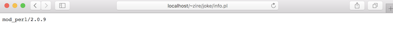

Title: Set Up Apache on Mac Sierra 10.12
Date: 2018-03-06 08:00
Category: Tech
Slug: set-up-apache-on-mac-sierra
Summary: Here's the how-to guide to set up Apache on Mac Sierra 10.12.6. It's more involving than just serving up a http server from a local directory, which can be done with `python -m SimpleHTTPServer 8080` (for Python 2.7) or `php -S <adddres>:<port>` (for PHP 5.4). 

Here's the how-to guide to set up Apache on Mac **Sierra 10.12.6**. It's more involving than just serving up a http server from a local directory, which can be done with `python -m SimpleHTTPServer 8080` (for Python 2.7) or `php -S <adddres>:<port>` (for PHP 5.4). 

Make a copy of the critical Apache configuration file first, before modifying it

```
sudo cp /etc/apache2/httpd.conf /etc/apache2/http.conf.bak
```

Uncomment several lines in the Apache configuration file **http.conf**

```
sudo vim /etc/apache2/httpd.conf
```

Enter into Edit Mode. To enable PHP, change

```
#LoadModule php5_module libexec/apache2/libphp5.so
```

into 

```
LoadModule php5_module libexec/apache2/libphp5.so
```

Might as well enable Perl. Change

```
#LoadModule perl_module libexec/apache2/mod_perl.so
```

into 

```
LoadModule perl_module libexec/apache2/mod_perl.so
```

To enable personal website, change

```
#LoadModule userdir_module libexec/apache2/mod_userdir.so
```

into 

```
LoadModule userdir_module libexec/apache2/mod_userdir.so
```

and also 

```
#Include /private/etc/apache2/extra/httpd-userdir.conf
```

into 

```
Include /private/etc/apache2/extra/httpd-userdir.conf
```

Lastly, grant permission by changing

```
<Directory />
	AllowOverride none
	Require all none
</Directory>
```

to 

```
<Directory />
	AllowOverride none
	Require all granted
</Directory>
```

Save the httpd.conf file and exit.

Open the file that was just enabled

```
sudo vim /etc/apache2/extra/httpd-userdir.conf
```

Uncomment Line 16 by changing

```
#Include /private/etc/apache2/users/*.conf
```

to 

```
Include /private/etc/apache2/users/*.conf
```

Mac's Lion and later versions no longer create a personal web site by default. To create one manually, 

```
mkdir ~/Sites
echo "<html><body><h1>My Awesome Site Works!</h1></body></html>" > ~/Sites/index.html.en
```

Then create a user configuration file for Apache, first figure out what is your username:

```
whoami
sudo vim /etc/apache2/users/<your short user name>.conf
```

Copy and paste the following content into the new file

```
<Directory "/Users/<your user name>/Sites/">
	AddLanguage en .en
	AddHandler perl-script .pl
	PerlHandler ModPerl::Registry
	Options Indexes MultiViews FollowSymLinks ExecCGI
	AllowOverride None
	Require host localhost
</Directory>
```

To check if the Apache configuration is valid, 

```
apachectl configtest
```

If the command returns `Syntax OK` then Apache is good to go. 

Turn on the Apache httpd service

```
sudo launchctl load -w /System/Library/LaunchDaemons/org.apache.httpd.plist
```

In browser, open this

[http://localhost/](http://localhost/)

It should say:

#It works!

Check if the user's Site directory is also open for business (xxx = your user name)

[http://localhost/~xxx](http://localhost/~xxx)

Create a PHP info file with

```
echo "<?php echo phpinfo(); ?>" > ~/Sites/info.php
```

Check this page to verify that PHP is running

[http://localhost/~xxx/info.php](http://localhost/~xxx/info.php)

Here's the result



Create a similar info file for Perl

```
echo "print \$ENV{MOD_PERL} . qq{\n};" >  ~/Sites/info.pl
```

Check this page to verify that Perl is running

[http://localhost/~xxx/info.pl](http://localhost/~xxx/info.pl)

Here's the result



That's it! To restart Apache with additional changes to the configuration

`sudo apachectl graceful` or `sudo apachectl restart`